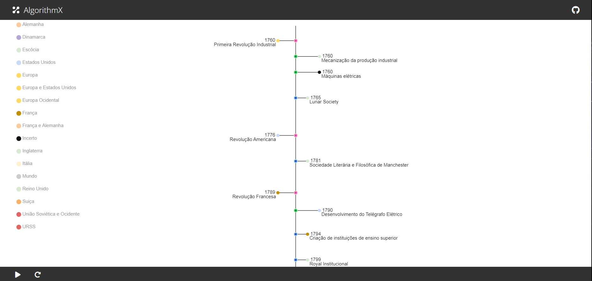

## Linha do tempo
___
Projeto desenvolvido para a disciplina de Ciência, Tecnologia e Sociedade. 
* Objetivo: destacar os eventos históricos mais relevantes entre os séculos 18 e 20, representando-os graficamente por meio de cores e símbolos de acordo com a região em que aconteceram e seu tipo (Científico, Histórico ou Institucional).

### Ferramentas utilizadas
* [Python](https://www.python.org)
* [AlgorithmX](https://algrx.github.io)
* [NetworkX](https://networkx.org)
* [openpyxl](https://pypi.org/project/openpyxl/)

### Como utilizar
```bash
# Clone o repositório
$ git clone https://github.com/jeniferss/linha-do-tempo.git

# Navegue até o repositório
$ cd linha-do-tempo

# Crie e ative uma env
$ python -m env env
$ .\env\Scripts\activate

# Instale as dependencias
$ pip instal -r requirements.txt

# Inicie o projeto
$ python main.py

# O servidor irá iniciar em http://localhost:5050
```
### Resultado
